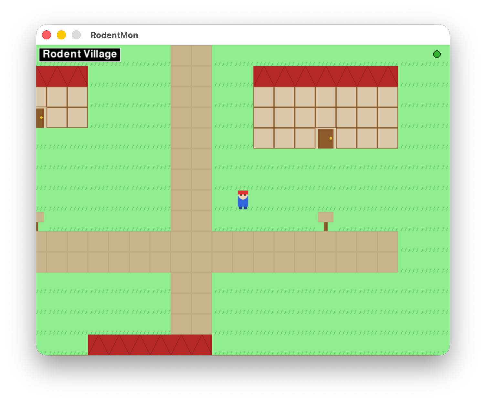

# RodentMon

A Pokémon-inspired RPG built with Python and Pygame — but instead of pocket monsters, you catch, train, and battle **rodents**.



## Features

- **Explore** a world of towns, routes, and buildings
- **Catch** wild rodents using Rodent Balls
- **Battle** wild rodents and trainers in turn-based combat
- **Train** your party — rodents gain XP, level up, learn new moves, and evolve
- **3-slot save system** — three independent save files with auto-save on map transitions and battle ends
- **Chiptune music** — five original 8-bit tracks (title, town, route, battle, gym) synthesised in memory at runtime
- **Sound effects** — 19 synthesised sound effects for every game event (attacks, faints, catches, level-ups, UI navigation, and more)

## Rodents

| Rodent | Type | Evolves Into |
|--------|------|--------------|
| Mouse | Normal | Rat (Lv. 16) |
| Gerbil | Sand | Desert Gerbil (Lv. 18) |
| Squirrel | Forest | Giant Squirrel (Lv. 20) |
| Bat | Shadow | Giant Bat (Lv. 22) |
| Hamster | Normal | — |

## Controls

| Key | Action |
|-----|--------|
| Arrow keys | Move / navigate menus |
| Z / Enter / Space | Confirm |
| X / Esc | Cancel / back |
| D | Delete save slot (on slot select screen) |

## Requirements

- Python 3.9+
- [pygame](https://www.pygame.org/) 2.x
- [numpy](https://numpy.org/)

## Running the Game

```bash
git clone https://github.com/zaynwm/RodentMon.git
cd RodentMon
pip install .
python3 rodentmon.py
```

## Project Structure

```
rodentmon.py   — main game (world, battles, UI)
music.py       — chiptune music engine (square/triangle wave synthesiser)
sfx.py         — sound effects engine (19 synthesised effects)
```

Audio is generated entirely at runtime — no external audio files are required.
